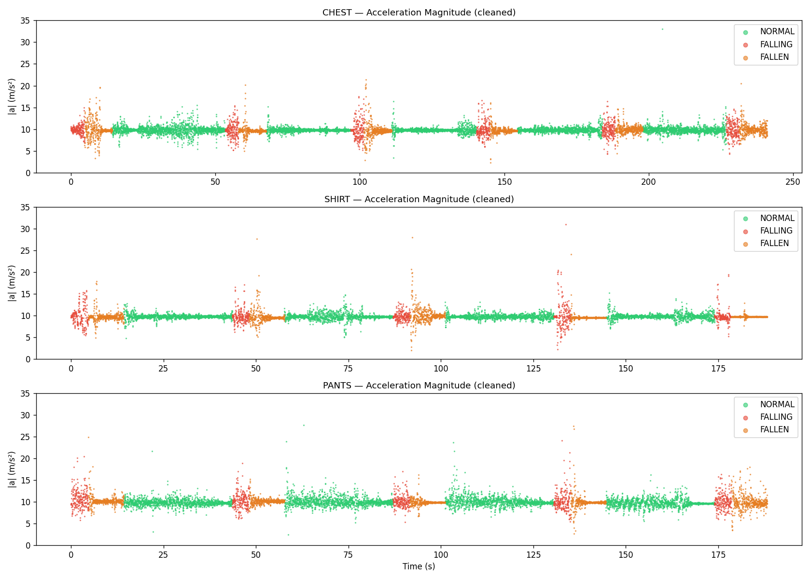
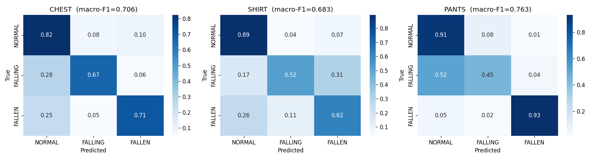
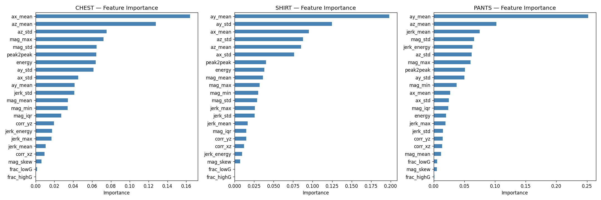

<div align="center">

# SafeStep
### AI-Powered Fall Detection & Emergency Alert System for the Elderly
### ระบบแจ้งเตือนการล้มสำหรับผู้สูงอายุด้วยปัญญาประดิษฐ์

[](LICENSE)


</div>

---

## ข้อมูลโครงการ

| | |
|---|---|
| **วิชา** | โครงงานวิศวกรรมคอมพิวเตอร์ |
| **ภาควิชา** | วิศวกรรมคอมพิวเตอร์ |
| **คณะ** | วิศวกรรมศาสตร์ |
| **มหาวิทยาลัย** | มหาวิทยาลัยเกษตรศาสตร์ (Kasetsart University) |
| **ปีการศึกษา** | 2568 |

---

## ผู้จัดทำ

| ชื่อ-นามสกุล | รหัสนักศึกษา |
|---|---|
| วีรพงษ์ ฮะภูริวัฒน์ | 6810503943 |
| ปณิธิ โลภาส | 6810503706 |
| ศิวกร แพรกปาน | 6810503986 |
| ภัทรวัฒน์ ตันหัน | 6810503820 |

---

## ภาพรวมระบบ

ระบบตรวจจับการล้มและแจ้งเตือนฉุกเฉินแบบ Real-time สำหรับผู้สูงอายุ ทำงานด้วย **ESP32-S3 + MPU6050 + GPS** และโมเดล **Machine Learning (Random Forest)** ที่รันบนตัวอุปกรณ์โดยตรง (on-device inference) ส่งแจ้งเตือนผ่าน **Blynk IoT** ไปยังผู้ดูแลและ **Web Dashboard** ทันที

```
┌─────────────────────────┐        Blynk Cloud        ┌─────────────────────────┐
│   User Device (ESP32-S3)│ ──────────────────────►   │  Caregiver (ESP32)      │
│                         │                            │                         │
│  • MPU6050 (accel/gyro) │    HTTP Direct Write       │  • LED RGB (status)     │
│  • GPS Module           │ ──────────────────────►   │  • Buzzer (alert)       │
│  • OLED Display         │                            │  • Switch (acknowledge) │
│  • Random Forest ML     │                            │  • LDR (ambient light)  │
│  • Threshold SM (5Hz)   │                            └─────────────────────────┘
└─────────────────────────┘                                        │
           │                                                        │
           └──────────────────── Blynk Cloud ──────────────────────┘
                                      │
                                      ▼
                         ┌────────────────────────┐
                         │   Web Dashboard         │
                         │  Next.js 15 + TypeScript│
                         │  Leaflet Map + Auth      │
                         └────────────────────────┘
```

| Component | เทคโนโลยี |
|---|---|
| User Device | ESP32-S3, MPU6050, GPS NEO-6M, OLED SSD1306 |
| Caregiver Device | ESP32, LED (RGB), Buzzer, LDR, Switch |
| Cloud | Blynk IoT |
| Web Dashboard | Next.js 15, TypeScript, Tailwind CSS, Leaflet |
| ML Training | Python, AutoGluon, scikit-learn, micromlgen |
| ML Inference | Random Forest 20 trees on-device (< 500 KB) |

---

## โครงสร้างไฟล์

```
Hardware-Project/
├── Full_System_README/
│   ├── Full_System_README.ino   ← Firmware หลัก (User Device ESP32-S3)
│   ├── config.h                 ← WiFi / Blynk credentials (ไม่รวมใน git)
│   ├── CHEST_model.h            ← ML model สำหรับโหมด Chest Clip
│   ├── SHIRT_model.h            ← ML model สำหรับโหมด Shirt Pocket
│   └── PANTS_model.h            ← ML model สำหรับโหมด Pants Pocket
│
├── Caregiver_Side/
│   ├── Caregiver_Side.ino       ← Firmware ฝั่งผู้ดูแล (Caregiver ESP32)
│   └── config.h                 ← WiFi / Blynk credentials (ไม่รวมใน git)
│
├── ML/
│   ├── CHEST_mode.ipynb         ← วิเคราะห์และ train model โหมด CHEST
│   ├── SHIRT_mode.ipynb         ← วิเคราะห์และ train model โหมด SHIRT
│   ├── PANTS_mode.ipynb         ← วิเคราะห์และ train model โหมด PANTS
│   ├── Evaluation.ipynb         ← เปรียบเทียบประสิทธิภาพ model ทุกโหมด
│   ├── ESP32_export.ipynb       ← Export RF model → C++ header (.h)
│   ├── RealData_Model.ipynb     ← Train จากข้อมูล real-world
│   ├── realdata_overview.png    ← Acceleration magnitude visualization
│   ├── realdata_confusion.png   ← Confusion matrix ทุกโหมด
│   ├── realdata_importance.png  ← Feature importance ทุกโหมด
│   └── models/esp32/            ← ไฟล์ .h ที่ export แล้ว
│
├── DataLogger/                  ← Arduino sketch บันทึกข้อมูล MPU6050
├── data_lable/                  ← ข้อมูลที่บันทึกและ label แล้ว
│
└── web/                         ← Web Dashboard (Next.js)
    ├── app/                     ← Pages (layout, page)
    ├── components/
    │   ├── dashboard-screen.tsx ← Dashboard หลัก + Leaflet Map
    │   ├── history-screen.tsx   ← ประวัติเหตุการณ์
    │   ├── emergency-screen.tsx ← หน้าฉุกเฉิน
    │   ├── auth-screen.tsx      ← Register / Login (รหัส 6 หลัก)
    │   └── map-card.tsx         ← แผนที่ GPS (Leaflet + OpenStreetMap)
    └── lib/
        ├── fall-detection-context.tsx  ← State management + Blynk polling
        ├── blynk-config.ts             ← Blynk REST API config
        └── user-store.ts               ← Auth ด้วย localStorage
```

---

## Hardware

### User Device (ESP32-S3)

| ส่วนประกอบ | GPIO |
|---|---|
| SDA (OLED + MPU6050) | GPIO 8 |
| SCL (OLED + MPU6050) | GPIO 9 |
| LED เขียว | GPIO 4 |
| LED เหลือง | GPIO 5 |
| LED แดง | GPIO 6 |
| Buzzer | GPIO 7 |
| BTN_MODE (สลับโหมด) | GPIO 10 |
| BTN_EMERGENCY (SOS) | GPIO 13 |
| GPS RX | GPIO 16 |
| GPS TX | GPIO 17 |

### Caregiver Device (ESP32)

| ส่วนประกอบ | GPIO |
|---|---|
| LED เขียว | GPIO 40 |
| LED เหลือง | GPIO 41 |
| LED แดง | GPIO 42 |
| Buzzer | GPIO 15 |
| Switch (Acknowledge) | GPIO 2 |
| LDR (แสงสว่าง) | GPIO 4 |

---

## Blynk Virtual Pins

| Pin | ข้อมูล | ประเภท |
|---|---|---|
| V0 | System Status (0=NORMAL, 1=WARNING, 2=FALL) | int |
| V1 | GPS Latitude | float |
| V2 | GPS Longitude | float |
| V3 | Mode (0=CHEST, 1=SHIRT, 2=PANTS) | int |
| V4 | Emergency Flag (0/1) | int |

---

## ML Model — ผลการทดสอบ

โมเดลถูก train จากข้อมูล real-world ที่เก็บโดยทีมงาน ด้วย **Random Forest Classifier** (n=20 trees, max_depth=10) แล้ว export เป็น C++ header ผ่าน `micromlgen` สำหรับรัน on-device บน ESP32

### ผลลัพธ์ (Macro F1-Score)

| โหมด | ตำแหน่งสวมใส่ | Features | Macro F1 |
|---|---|---|---|
| **CHEST** | หน้าอก (Chest Clip) | 22 | **0.706** |
| **SHIRT** | กระเป๋าเสื้อ (Shirt Pocket) | 22 | **0.683** |
| **PANTS** | กระเป๋ากางเกง (Pants Pocket) | 22 | **0.763** |

> **Architecture:** RandomForestClassifier (n=20, max_depth=10, max_leaf_nodes=80)
> **Export:** micromlgen → C++ if/else header < 500 KB ต่อโหมด
> **Classes:** 0=NORMAL · 1=FALLING · 2=FALLEN

### Acceleration Magnitude — Data Overview



*ข้อมูล accelerometer magnitude จากทั้ง 3 โหมด แสดง pattern ที่แตกต่างระหว่าง NORMAL (เขียว), FALLING (แดง), FALLEN (ส้ม)*

### Confusion Matrix



*Confusion matrix (normalized) ของ Random Forest ทั้ง 3 โหมด*
*PANTS ทำได้ดีที่สุด — FALLEN recall สูงถึง 0.93*

### Feature Importance



*Top features ที่โมเดลให้น้ำหนักสูงสุด — `ay_mean`, `ax_mean`, `az_mean` และ `jerk_mean` มีผลต่อการตัดสินใจมากที่สุดในทุกโหมด*

---

## การติดตั้งและใช้งาน

### 1. Arduino Firmware

```bash
# ติดตั้ง Libraries ใน Arduino IDE (Library Manager)
- Blynk by Volodymyr Shymanskyy
- Adafruit MPU6050
- Adafruit SSD1306 + Adafruit GFX
- TinyGPS by Mikal Hart

# สร้าง config.h ในแต่ละ sketch folder
#define BLYNK_TEMPLATE_ID   "..."
#define BLYNK_TEMPLATE_NAME "ElderlySafetySystem"
#define BLYNK_AUTH_TOKEN    "..."
#define WIFI_SSID           "..."
#define WIFI_PASS           "..."
#define CAREGIVER_TOKEN     "..."   // (User Device config.h เท่านั้น)
```

### 2. Web Dashboard

```bash
cd web
pnpm install
echo "NEXT_PUBLIC_BLYNK_TOKEN=your_token_here" > .env.local
pnpm dev
# เปิด http://localhost:3000
```

### 3. Blynk Setup

1. สมัคร [blynk.cloud](https://blynk.cloud)
2. สร้าง Template ชื่อ `ElderlySafetySystem`
3. เพิ่ม Datastreams: V0 (int), V1 (double), V2 (double), V3 (int), V4 (int)
4. สร้าง 2 Devices: **User Device** + **Caregiver Device**
5. คัดลอก Auth Token ของแต่ละ device ใส่ใน `config.h` ที่ตรงกัน

### 4. Export ML Models (สำหรับ retrain)

```bash
source venv/bin/activate
jupyter notebook ML/RealData_Model.ipynb   # train จาก real-world data
jupyter notebook ML/ESP32_export.ipynb     # export → C++ header
cp ML/models/esp32/*.h Full_System_README/
```

---

## การทำงานของระบบ

```
เปิดเครื่อง
    │
    ├─ Calibrate MPU6050 (10 วินาที) → auto-detect sensor scale
    ├─ Connect WiFi + Blynk (timeout 10s — ทำงาน offline ได้)
    ▼
MONITORING ACTIVE
    │
    ├─ [MPU6050 @ 5Hz]  Threshold State Machine
    │       Path A: Freefall (acc < 3 m/s²) → Impact (acc > 14.7 m/s²)
    │               → Verify 3s → FALL
    │       Path B: High-Jerk (> 22 m/s²/sample) → Verify 3s → FALL
    │
    ├─ [MPU6050 @ 50Hz] ML Buffer → Inference ทุก 0.5s
    │       Random Forest → pred=FALLEN × 2 ติดกัน → confirm FALL
    │
    ├─ [OLED]  แสดง mode / fallState / mag / jerk แบบ real-time
    ├─ [BTN10] เปลี่ยนโหมด CHEST → SHIRT → PANTS → (วนซ้ำ)
    ├─ [BTN13] Manual SOS / ยกเลิก SOS
    │
    ▼ เมื่อ FALL ถูกยืนยัน
    ├─ Blynk V0=2, V4=1 (User device)
    ├─ HTTP ส่งตรงถึง Caregiver device V4=1
    ├─ GPS พิกัด → V1, V2
    ├─ OLED แสดง "!! FALL !!" + timer
    ├─ Web Dashboard → Emergency screen + Leaflet Map
    └─ กด BTN10 หรือ Acknowledge บน Web → ล้าง emergency
```

---

## License

MIT License — ดูรายละเอียดใน [LICENSE](LICENSE)

---

<div align="center">

*SafeStep — Elderly Safety System*
*คณะวิศวกรรมศาสตร์ มหาวิทยาลัยเกษตรศาสตร์ 2567*

</div>
